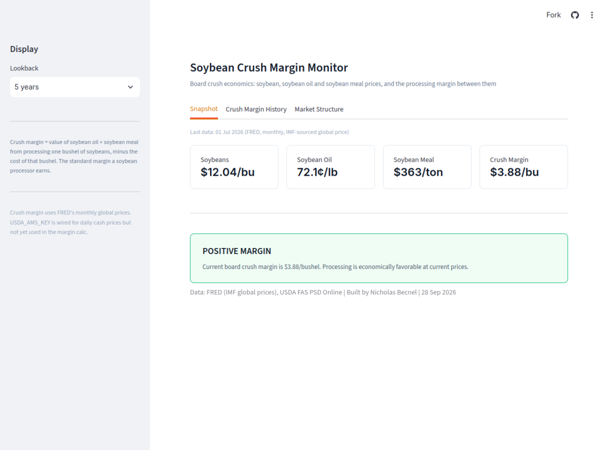

# Soybean Crush Margin Monitor

Live dashboard for board crush economics: soybean, soybean oil, and soybean meal
prices, and the processing margin between them.

**Live app:** https://soy-crush-monitor.streamlit.app/



## What it does

The board crush margin is the standard measure of a soybean processor's economics:
the value of the oil and meal one bushel of soybeans yields, minus the cost of that
bushel. A positive margin means processing is profitable at current prices; a
negative margin means crush plants are running at a loss.

- **Snapshot** — current soybean, oil, and meal prices and the resulting crush margin
- **Crush Margin History** — normalized price history for all three legs, plus the
  margin over time (5-year default lookback, adjustable)
- **Market Structure** — US soybean stocks-to-use ratio by USDA marketing year, the
  standard agricultural-economics measure of market tightness

## Data sources

| Source | What it provides | Required |
|---|---|---|
| [FRED](https://fred.stlouisfed.org/) (IMF-sourced global prices) | Monthly soybean, soybean oil, and soybean meal prices | Yes |
| [USDA FAS PSD Online](https://apps.fas.usda.gov/psdonline/) | Annual US ending stocks, exports, and domestic consumption (for stocks-to-use) | No — Market Structure tab degrades gracefully without it |
| [USDA AMS MyMarketNews](https://mymarketnews.ams.usda.gov/) | Daily cash grain prices | No — wired but not yet used in the margin calc (see below) |

All optional sources fail gracefully: if a key is missing or a request fails, the
app falls back to FRED's monthly series and simply hides the section that needed
the extra data, rather than crashing.

## Running locally

```bash
pip install -r requirements.txt
```

Create `.streamlit/secrets.toml`:

```toml
FRED_KEY = "your_fred_api_key"
USDA_FAS_KEY = "your_fas_api_key"       # optional
USDA_AMS_KEY = "your_ams_api_key"       # optional
USDA_NASS_KEY = "your_nass_api_key"     # optional
```

```bash
streamlit run app.py
```

## Known limitations

- Crush margin uses FRED's **monthly** global prices, not daily cash prices. A daily
  USDA AMS cash-price feed is fetched (`fetch_ams_daily_price`) but not yet wired
  into the margin calculation.
- FAS PSD is annual data, so the Market Structure tab shows one point per marketing
  year, not a continuous time series.

---

Built by Nicholas Becnel. Companion project: [brent-wti-arb](https://github.com/ncbecnel/brent-wti-arb), a Brent-WTI physical arbitrage monitor.
